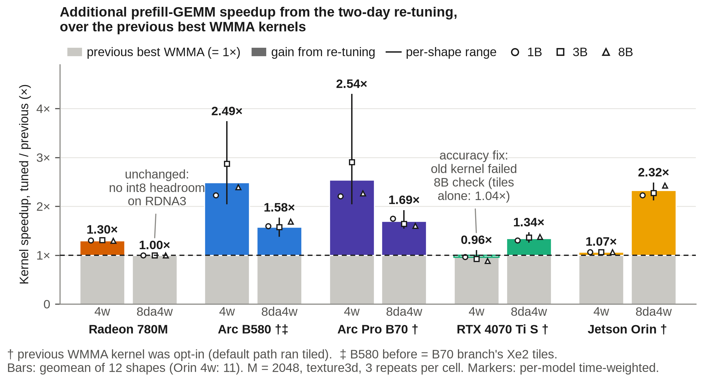
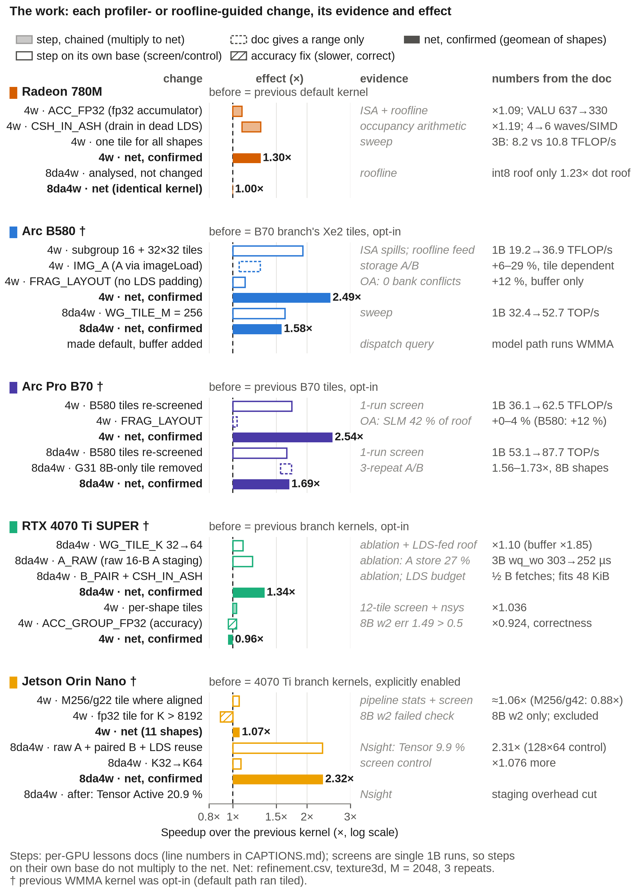
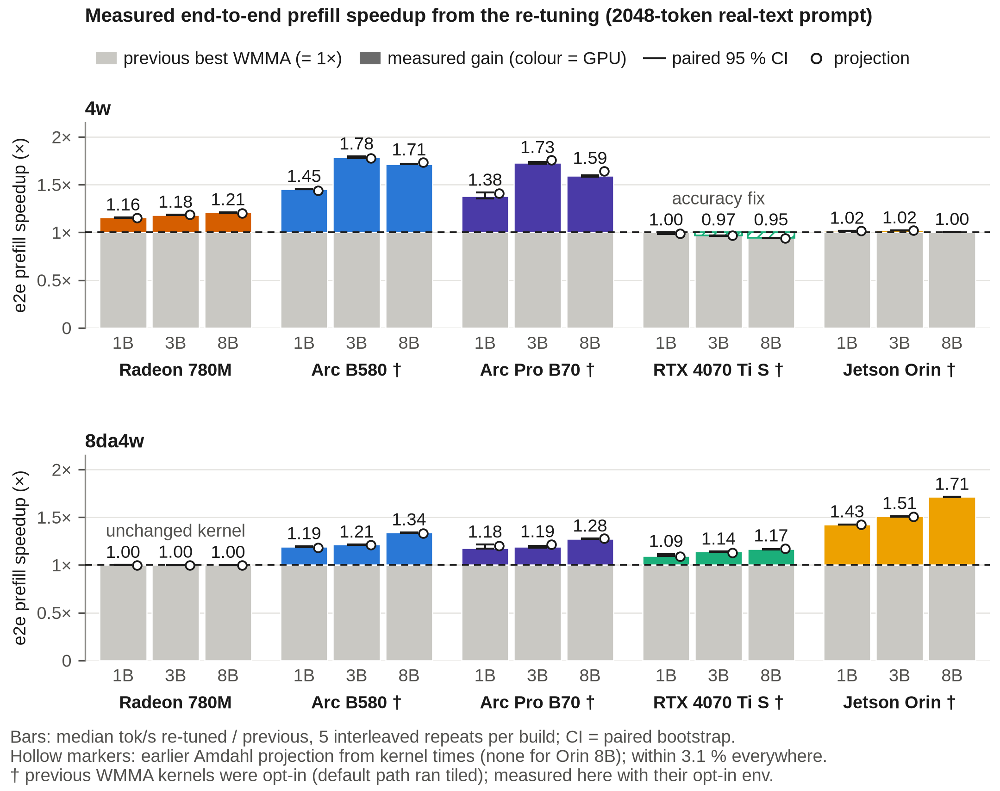
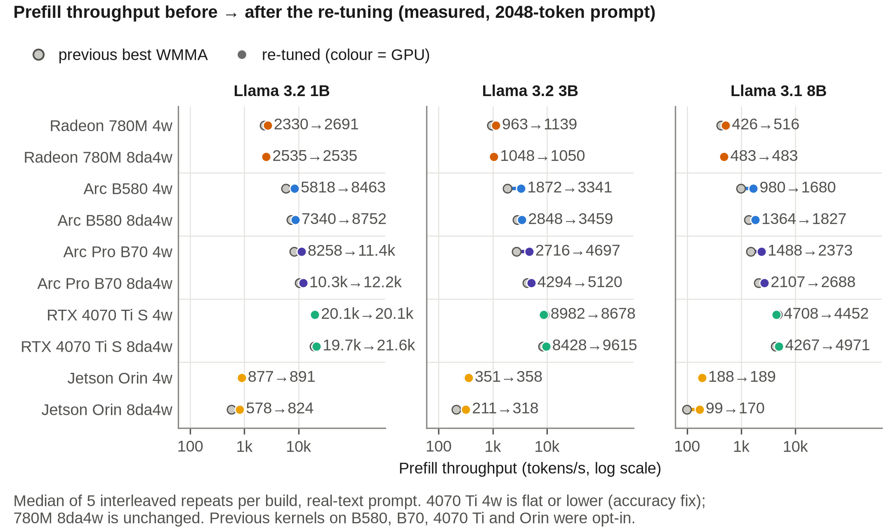
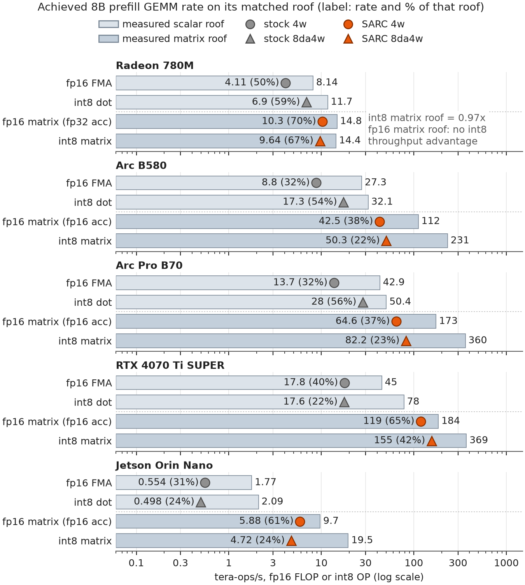
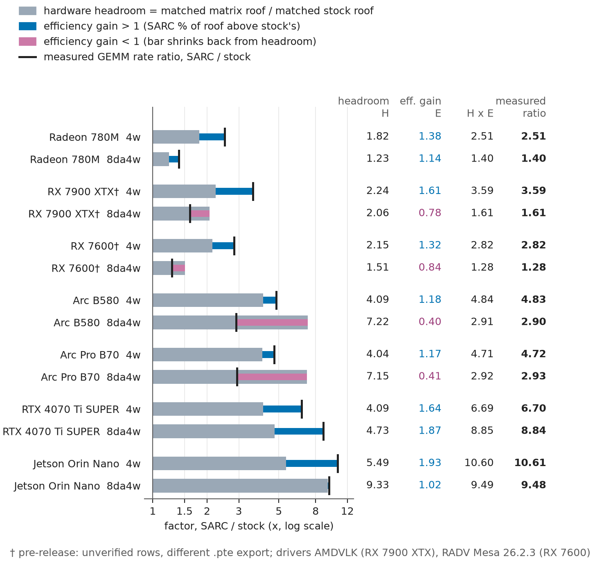
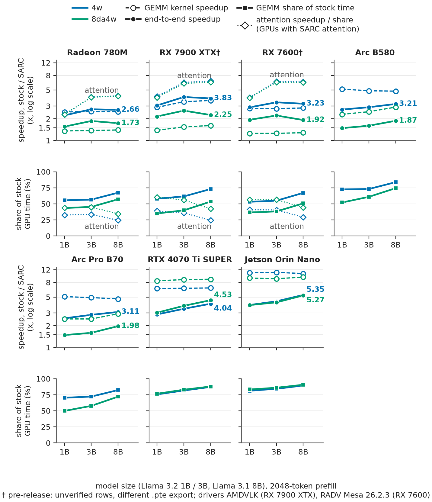
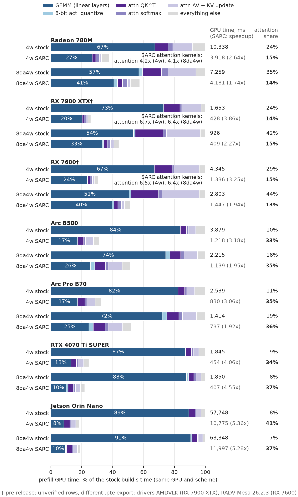

# SARC WMMA prefill kernels: two-day re-tuning results and evidence

Engineering report, 2026-09-28.
- **Part A**: what the last two days of profiler-guided re-tuning added on top of the previous best kernels, measured end to end.
- **Part B**: the evidence base for the current state on ExecuTorch release 1.5 (roofline, kernel traces, correctness, open questions).

# Part A — The two-day WMMA re-tuning (2026-09-26/27): what it added

## A0. Summary for the manager

**The work.** Over two days I re-tuned each GPU's existing WMMA (cooperative-matrix) prefill kernels, on five GPUs from three vendors:
- AMD Radeon 780M;
- Intel Arc B580 and Arc Pro B70;
- NVIDIA RTX 4070 Ti SUPER and Jetson Orin Nano.

Every change was driven by roofline measurements and per-vendor profiler evidence: ISA dumps and in-kernel clocks on AMD, ISA and OA counters on Intel, Nsight on NVIDIA.

**Result: additional prefill-GEMM speedup on top of the previous best WMMA kernels** (kernel level, 12 shapes of Llama 3.2 1B, Llama 3.2 3B and Llama 3.1 8B, geomean):

| GPU | 4-bit weights (4w) | 8-bit activations (8da4w) |
|---|---|---|
| Arc Pro B70 | **2.54×** | **1.69×** |
| Arc B580 | **2.49×** | **1.58×** |
| Jetson Orin Nano | 1.07× | **2.32×** |
| RTX 4070 Ti SUPER | 0.96× (accuracy fix, see A4) | **1.34×** |
| Radeon 780M | **1.30×** | 1.00× (no int8 headroom on this GPU) |

**End-to-end effect, measured.** Each GPU's previous and re-tuned builds were rebuilt from their exact commits
and run end to end: 2048-token real-text prefill, 5 interleaved repeats each, 30 configurations.
- Up to **1.78×** (B580 3B 4w), **1.73×** (B70 3B 4w) and **1.71×** (Orin 8B 8da4w).
- Geometric mean over all configurations: **1.23×**. Best per GPU: B580 1.43×, B70 1.38×, Orin 1.25×.

**Beyond speed, the two days also:**
- made the tuned kernels the **default model path** on four of the five GPUs. Before, the previous WMMA kernels on B580, B70, 4070 Ti and Orin had to be switched on by hand; an exported model ran the slow tiled kernel.
- fixed a real accuracy bug: the previous 4070 Ti 4w kernel failed the 8B check.
- ported everything to ExecuTorch release 1.5 with no loss: kernels match within ±3 %.

**Where that leaves the product (Part B).** Against stock ExecuTorch 1.5 the full SARC release is 1.48–5.35× faster end to end, with a geometric mean of 2.75×. That number reflects all the work to date; this part isolates what the last two days added.



*Figure A1. Additional prefill-GEMM speedup over the previous best WMMA kernel of the same GPU (= 1×).*
- Bars: geomean over 12 shapes (Orin 4w: 11).
- Markers: per-model, time-weighted by calls per layer. Thin lines: per-shape min–max.
- Setup: M = 2048, texture3d model path, 3 repeats per cell, previous and tuned kernels in the same harness.
- † The previous WMMA kernel was opt-in; the default ran tiled. ‡ B580's "before" was the B70 branch's Xe2 tiles.

## A1. How the gains were found (evidence, not trial and error)

Every change in Figure A3 is tied to a measurement. The profiling route differs by vendor, because the tools differ:

| GPU | Evidence route | Example finding → change → effect |
|---|---|---|
| Radeon 780M | roofline + RADV ISA stats + in-kernel `shader_clock` phase timing (SQTT is banned; no perf counters on GFX11) | ISA: about 350 accumulator-repack moves per 32 WMMAs with an fp16 accumulator → fp32 accumulator, ×1.09; occupancy arithmetic → drain staged in dead LDS, ×1.19 |
| Arc B580 / B70 | Xe ISA dumps (spill counts, SIMD width) + OA counters + roofline "fed-matrix" sweeps | ISA: the subgroup-32 kernel spilled (11:26) at SIMD32 → subgroup 16, 1B 19.2 → 36.9 TFLOP/s; sweep → M = 256 tiles for 8da4w, 32.4 → 52.7 TOP/s |
| RTX 4070 Ti SUPER | Nsight GPU metrics (Tensor Active, SM Issue) + ablations + LDS-fed roofline | K 32 → 64 (MMA phase too short to hide staging), ×1.10; raw A staging, 303 → 252 µs on 3B wq_wo |
| Jetson Orin Nano | Nsight (Tensor Active) + pipeline statistics + screens | 8da4w Tensor Active 9.9 % → staging redesign, 2.31× on a control tile; Tensor Active rises to 20.9 % |



*Figure A3. Each profiler- or roofline-guided change, its evidence and its effect.*
- Chained steps multiply to the net. Screens and controls stand on their own base, because they are single 1B runs.
- Hatched bars are accuracy fixes.
- Numbers come from the per-GPU study documents; line references are in `evidence/refinement/figures/CAPTIONS.md`.

## A2. Kernel-level results, per model

Source: `evidence/refinement/refinement.csv`, built from the study's raw microbench runs (3 repeats each; WMMA repeat spread ≤ 4.1 % in every cell). Values are after/before time, texture3d model path, weighted by calls per layer.

| GPU · scheme | 1B | 3B | 8B | geomean (12 shapes) | Before → after runs |
|---|---|---|---|---|---|
| 780M · 4w | 1.30 | 1.31 | 1.30 | **1.30** | `runs/780m-branch/780m` → `confirm/780m-final` |
| 780M · 8da4w | 1.00 | 1.00 | 1.00 | 1.00 (identical kernel) | same |
| B580 · 4w | 2.23 | 2.87 | 2.39 | **2.49** | `runs/b70-branch/b580` → `confirm/b580-default-v1` |
| B580 · 8da4w | 1.60 | 1.58 | 1.69 | **1.58** | same |
| B70 · 4w | 2.21 | 2.91 | 2.27 | **2.54** | `runs/b70-branch/b70-0` → `confirm/b70-default-v1` |
| B70 · 8da4w | 1.75 | 1.64 | 1.60 | **1.69** | same |
| 4070 Ti · 4w | 0.96 | 0.92 | 0.89 | 0.96 | `runs/4070ti-branch` → `runs/4070ti-final3` |
| 4070 Ti · 8da4w | 1.31 | 1.37 | 1.38 | **1.34** | same |
| Orin · 4w | 1.06 | 1.07 | 1.07 (w2 excluded) | 1.07 | Jetson study `confirm/comparison.json` (interleaved in one session) |
| Orin · 8da4w | 2.23 | 2.27 | 2.42 | **2.32** | same |

**Controls**
- Within each before/after pair, the tiled kernel was unchanged. Its before/after ratio is 0.997–1.005 on the 780M, B580 and B70.
- On the 4070 Ti, 44 of 48 cells are within ±3 %; the 4 exceptions are noisy tiled cells, not WMMA cells.
- So the device state was the same in each pair.

## A3. End-to-end impact of the re-tuning (measured)



*Figure A2. Measured end-to-end prefill speedup, re-tuned vs previous kernels, on a 2048-token real-text prompt.*
- Bars: ratio of medians of 5 interleaved runs. Error bars: approximate 95 % paired bootstrap CI.
- Hollow markers: the earlier Amdahl projection from kernel times.

**How it was measured**
- Each GPU's previous and re-tuned builds were rebuilt from their exact release-1.4 commits:

  | GPU | previous | re-tuned |
  |---|---|---|
  | 780M | `eae4d4af4` | `9178cee44` |
  | Xe2 | `ab9978f16` | B580 `7d47b6ee3`, B70 `545ccf85c` |
  | 4070 Ti | `be54d12db` | `432709b92` |
  | Orin | `0270403ba` | `0b260ffab` |

  - Four of the trees needed the compile-only `<algorithm>` include backport.
- The previous build ran with the opt-in environment it needed; the re-tuned build ran on defaults.
- Protocol, as in Part B: fresh process per run, `--warmup`, cool-down, co-tenant services stopped, and
  builds alternating first/second.
- Data: `report/refine/cells.csv` and `runs_all.csv`; raw logs in `refine-e2e-2026-09-28/raw/`.

Cells show prefill tok/s (median of 5), previous → re-tuned, then the speedup and its CI.

**4w**

| GPU | 1B | 3B | 8B | earlier projection |
|---|---|---|---|---|
| Arc B580 | 5,818 → 8,463<br>**1.45×** [1.45, 1.45] | 1,872 → 3,341<br>**1.78×** [1.78, 1.80] | 980 → 1,680<br>**1.71×** [1.71, 1.72] | 1.44 / 1.78 / 1.73 |
| Arc Pro B70 | 8,258 → 11,378<br>**1.38×** [1.36, 1.42] | 2,716 → 4,697<br>**1.73×** [1.72, 1.74] | 1,488 → 2,373<br>**1.59×** [1.58, 1.60] | 1.41 / 1.76 / 1.64 |
| Radeon 780M | 2,330 → 2,691<br>**1.16×** [1.15, 1.16] | 963 → 1,139<br>**1.18×** [1.18, 1.18] | 426 → 516<br>**1.21×** [1.20, 1.21] | 1.15 / 1.19 / 1.20 |
| RTX 4070 Ti SUPER | 20,078 → 20,078<br>1.00× [0.98, 1.00] | 8,982 → 8,678<br>0.97× [0.96, 0.97] | 4,708 → 4,452<br>0.95× [0.94, 0.95] | 0.99 / 0.97 / 0.94 |
| Jetson Orin Nano | 877 → 891<br>1.02× [1.02, 1.02] | 351 → 358<br>1.02× [1.02, 1.02] | 188 → 189<br>1.00× [1.00, 1.00] | 1.02 / 1.02 / — |

**8da4w**

| GPU | 1B | 3B | 8B | earlier projection |
|---|---|---|---|---|
| Arc B580 | 7,340 → 8,752<br>**1.19×** [1.19, 1.20] | 2,848 → 3,459<br>**1.21×** [1.21, 1.21] | 1,364 → 1,827<br>**1.34×** [1.34, 1.34] | 1.18 / 1.21 / 1.33 |
| Arc Pro B70 | 10,343 → 12,190<br>**1.18×** [1.17, 1.21] | 4,294 → 5,120<br>**1.19×** [1.18, 1.20] | 2,107 → 2,688<br>**1.28×** [1.27, 1.28] | 1.20 / 1.22 / 1.28 |
| Radeon 780M | 2,535 → 2,535<br>1.00× | 1,048 → 1,050<br>1.00× | 483 → 483<br>1.00× | 1.00 (kernel unchanged) |
| RTX 4070 Ti SUPER | 19,692 → 21,558<br>**1.09×** [1.09, 1.12] | 8,428 → 9,615<br>**1.14×** [1.14, 1.14] | 4,267 → 4,971<br>**1.17×** [1.16, 1.17] | 1.09 / 1.13 / 1.17 |
| Jetson Orin Nano | 578 → 824<br>**1.43×** [1.43, 1.43] | 211 → 318<br>**1.51×** [1.51, 1.51] | 99 → 170<br>**1.71×** [1.71, 1.71] | 1.42 / 1.51 / — |

| Geomean, re-tuned / previous | 4w | 8da4w | both |
|---|---|---|---|
| Arc B580 | 1.64× | 1.25× | **1.43×** |
| Arc Pro B70 | 1.56× | 1.21× | **1.38×** |
| Jetson Orin Nano | 1.01× | 1.55× | **1.25×** |
| Radeon 780M | 1.18× | 1.00× | 1.09× |
| RTX 4070 Ti SUPER | 0.97× | 1.13× | 1.05× |
| **all** | 1.24× | 1.22× | **1.23×** |

**Checks**
- Measured and projected agree within 3.1 % in every cell (the largest gap is B70 8B 4w, 1.59× vs 1.64×), so
  the kernel-level results in A2 translate to the model as predicted.
- Timing resolution is 1 ms. At about 100 ms per prefill (4070 Ti 1B) one step is about 1 %, so the 4070 Ti 1B cells
  and zero-width CIs are at that resolution. For example, both 4070 Ti 1B 4w medians are 102 ms, giving exactly 1.00×.
- 28 of 30 cells have a repeat spread ≤ 3 %. The exceptions are B70 1B 4w (3.7 %) and 1B 8da4w (3.0 %).
- One previous-build run crashed on exit (4070 Ti 8B 8da4w, rc = 134). It is kept in the CSV and was retried.



*Figure A4. Absolute prefill tok/s, previous → re-tuned kernels (real-text 2048-token prompt, median of 5).*

## A4. What the model path actually runs: opt-in → default

On B580, B70, 4070 Ti and Orin, the previous WMMA kernels were **opt-in**:
- they needed `ET_VK_TEXTURE_COOPMAT=1`, `ET_VK_COOPMAT_ANY_DEVICE=1`, or explicit enabling on Orin;
- an exported model therefore ran the tiled kernel by default.

The two days made the tuned kernels the **per-device default**. For a user who changes nothing, the model path went from tiled to tuned WMMA.

**Proof that the opt-in mattered.** In this campaign, 1B, the previous build was run once with and once without its opt-in environment:

| GPU | previous build, no env (default path) | previous build + opt-in env | re-tuned default (median) | default-path gain |
|---|---|---|---|---|
| RTX 4070 Ti SUPER 4w | 5,596 | 20,078 | 20,078 | **3.6×** |
| RTX 4070 Ti SUPER 8da4w | 6,804 | 14,027 | 21,558 | **3.2×** |
| Jetson Orin Nano 4w | 172 | 876 | 891 | **5.2×** |
| Jetson Orin Nano 8da4w | 213 | 577 | 824 | **3.9×** |
| Arc B580 4w | 2,576 | 5,802 | 8,463 | **3.3×** |
| Arc Pro B70 4w | 3,670 | 8,192 | 11,378 | **3.1×** |
| Radeon 780M 4w | 2,330 | 2,330 | 2,691 | 1.16× (already default) |

The no-env and env columns are single runs, and the first runs of each session. The 4070 Ti 8da4w env run (14,027)
is below that build's 5-run median in A3 (19,692); the default-path gain uses the re-tuned 5-run median.

The earlier full measurement of this default-path change on the release-1.4 branches: 3 repeats, same next token as tiled (`igpu-roofline/docs/WMMA-STUDY-TAKEAWAYS.md` L35–40).

| GPU | 4w, 1B / 3B / 8B | 8da4w, 1B / 3B / 8B |
|---|---|---|
| RTX 4070 Ti SUPER | 3.57 / 4.30 / 5.11× | 3.11 / 3.78 / 4.54× |
| Arc Pro B70 | 3.15 / 4.16 / 4.81× | 1.48 / 1.59 / 1.97× |
| Arc B580 | 3.23 / 4.11 / 4.73× | 1.43 / 1.55 / 1.94× |

On the 780M the previous WMMA kernel was already the default, so its default-path gain is the A3 figure (1.15–1.20× for 4w).

## A5. Exceptions, stated plainly

- **RTX 4070 Ti SUPER 4w: 0.96× (0.89× at 8B).**
  - The new tiles were 1.036× faster.
  - Then the previous kernel's fp16 accumulation was found to fail the 8B w2 projection check: max error 1.49 against a 0.5 tolerance.
  - The fix, per-group fp32 accumulation, costs 0.924×. It is a correctness fix, kept deliberately.
- **Radeon 780M 8da4w: unchanged.** Roofline: the 780M's int8 matrix roof is only 1.23× its int8 dot roof, and the kernel already ran at 65–70 % of it, so there was little to gain.
- **B580's "before"** was the B70 branch's Xe2 tiles; no B580-specific WMMA kernel existed.
- **B580/B70 buffer storage** has no "before": the previous branch crashed on buffer. The re-tuning added it.
- **Orin 8B w2** is excluded from the 4w geomean: the original kernel was numerically wrong on that shape.
- **One stability issue is open.** Two 8B runs on the 4070 Ti crashed at process exit, after producing correct
  output: one previous build, one current SARC build (§B10). They were retried; the timings are unaffected.
- **Clocks were not pinned.**
  - In A2, the tiled controls bound the device-state drift.
  - In A3, the two builds alternate within every repeat, so both see the same device state.

## A6. Where to go next (from the Part B evidence)

- **Attention.** After re-tuning, attention is 33–41 % of prefill time on the four GPUs without a SARC attention kernel. The 780M's attention kernels gave 4× there (§B5).
- **8-bit kernels on Intel and Orin.** They reach 22–24 % of the int8 matrix roof, against 42 % on the 4070 Ti (§B3, §B7).

Evidence files: `evidence/refinement/` (dataset, generator, provenance and figures).

---

# Part B — Current state on release 1.5: results and evidence

Technical report for engineering review, 2026-09-28.

The headline benchmark is in [REPORT.md](REPORT.md): 30 configurations and 300 timed runs, with SARC's
cooperative-matrix kernels 1.48–5.35× faster than stock ExecuTorch 1.5 at 2048-token prefill. This document
explains those numbers.

An independent audit re-derived every number from the raw data; its findings are applied here.

Evidence labels:

| Label | Meaning |
|---|---|
| **[M]** | Measured in this campaign: timed runs, warm ETDump kernel traces, logits |
| **[R]** | Measured by the roofline tool: confirmed campaign roofs, not this campaign |
| **[S]** | Read from shader or selection source; not ISA-verified |
| **[I]** | Inference from [M]/[R]/[S] data. Plausible, but alternatives are not excluded |
| **[O]** | Open: not measured |

## B1. Summary of findings

1. **Stock 1.5 prefill runs on scalar units; SARC runs on the matrix units.** [M][R][S]
   - Stock's GEMM kernels use scalar fp16 FMA (4w) and int8 dot (8da4w), and reach 22–59 % of those scalar
     roofs.
   - SARC's coopmat kernels reach 22–70 % of the matrix roofs.
   - The matrix roofs are 1.2–9.3× the scalar roofs stock is bound by.
   - The GEMM kernel speedup ranges from 1.40× (780M 8da4w) to 10.6× (Orin 4w). It splits exactly into a
     hardware-headroom term and an efficiency term (§B4). That split is an accounting identity, not independent
     confirmation.
   - Headroom is the dominant term on the Orin and on Intel.
2. **The end-to-end gain is smaller than the GEMM gain, and it grows with model size.** [M]
   - GEMMs are 43–91 % of stock prefill time. Attention and everything else run at about 1× outside the 780M.
   - Where the GEMM speedup is roughly constant across sizes (780M, 4070 Ti, Orin), the growing GEMM share alone
     makes the end-to-end speedup grow.
   - On Intel the GEMM speedup is **not** constant. For 8da4w it rises with size (B580 2.30 → 2.90) because the
     stock kernel loses efficiency; for 4w it falls slightly (5.16 → 4.83). See §B5.
3. **On the 780M, 8B speeds up slightly less than 3B.** [M]
   - It is the only GPU where SARC also replaces attention, and attention gains more there than GEMMs do
     (4.0–4.2× vs 2.5×).
   - Attention's share of stock time falls from 34 % at 3B to 24 % at 8B (§B5).
4. **Stock 8da4w beats stock 4w on AMD and Intel, but not on NVIDIA.** [M][R]
   - On the 780M and Intel, the int8 dot roof is 1.2–1.4× the fp16 FMA roof, and stock 8da4w also runs at a
     higher fraction of its roof.
   - On the 4070 Ti and Orin, stock 8da4w reaches only 22–24 % of its dot roof and runs at nearly the same
     absolute rate as stock 4w.
   - **Why** is **[O]**; §B6 gives two candidates.
5. **After tuning, the faster scheme depends on the GPU.** (§B7)
   - **780M: 4w wins by 7.5 %.** [M][R]
     - The int8 matrix roof is 0.97× the fp16 roof SARC 4w uses, and the int8 kernel is 6.8 % slower (+188 ms).
     - 8da4w adds activation quantization (+166 ms) and saves some view copies (−92 ms).
     - The quantize pass and the copies are software, so part of the gap is recoverable [I].
   - **Orin: 4w wins.** [M] SARC 8da4w reaches 24 % of the int8 register roof, against 61 % for 4w on its roof.
     Why is **[I]/[O]** (§B7).
   - **Intel: a tie, or 8da4w by 12 %.** [M]
   - **4070 Ti: 8da4w wins by 12 %.** [M]
6. **Correctness: SARC and stock agree on every tile-aligned real-text prediction.** [M]
   - On a 2048-token real-text prompt, SARC and stock produce the same top-1 token in 30/30 configurations.
   - The largest logit difference is 2.0, well below the smallest top-1 margin of 2.4.
   - The earlier 1972-token check mostly did not exercise SARC's GEMMs: by design, SARC falls back to stock
     kernels at unaligned M.
   - Its 3 differences sit at a position where the two tokens are 0.09–0.15 logit apart (§B8).
7. **Where the next speedup is.** [M]→[I]
   - After SARC, attention is 33–41 % of 8B prefill time on the four GPUs without a SARC attention row.
   - SARC 8da4w GEMMs reach only 22–24 % of the int8 register roof on Intel and Orin (§B9).
8. **The repeated-"the" timing prompt does not bias the results.** [M]
   - Re-timing all 30 configurations on a 2048-token real-text prompt gives absolute tok/s within −3.4 % to +2.5
     % of the original. The one exception is the noisy B580 8B 8da4w SARC arm, at +9.5 %.
   - Speedups agree within ±0.07×. The exception is that same cell: 1.87× → 2.00× (§B10).

## B2. Evidence base

| Source | What it gives | Quality notes |
|---|---|---|
| Timed runs ([REPORT.md](REPORT.md), `raw/*/runs.csv`) | End-to-end tok/s, n = 5 per build, 300/300 accepted | Clocks not pinned; B580 noisier (display GPU); prompt is repeated "the" (§B10) |
| Warm ETDump traces (`raw/*/trace2/*.etdp`, 60 files) | GPU time per dispatch, with operator name and tensor shapes | One `--warmup` run per cell. Each event has 2 `raw` entries; the last is the warm execution (checked against `start_time` order and the logged run time). Trace graph time vs timed median: −6.7 % to +3.8 %. [trace_analysis.py](results/scripts/trace_analysis.py) → `evidence/trace/{families,gemm,totals}.csv` |
| Confirmed roofs ([evidence/roofline.md](evidence/roofline.md), `roofline.json`) | Measured matrix, scalar, fed-matrix and memory peaks per GPU, each with its REPORT.md line | `fast` plan, 3 fresh-process repeats, spread ≤ 3.2 %, sentinel healthy on all 34 checks. **Not ISA-verified.** Sustained roofs unconfirmed. 780M `standard` campaign agrees within 3.4 %. Measured 2026-09-26/27, not on the benchmark day |
| Kernel efficiency ([evidence/efficiency.py](evidence/efficiency.py) → `efficiency.csv`) | Achieved prefill-GEMM rate = Σ 2·M·N·K / Σ GPU time, and % of the matched roof | Kernel level only. The 8da4w quantize dispatch and the stock 4w input transpose are reported separately (§B5). Logical FLOPs |
| Logits ([evidence/logits/](evidence/logits/)) | fp32 CPU reference; 8da4w Vulkan logits at the disputed position | Vulkan logits come from the ExecuTorch Python runtime built from the SARC dev tree, whose B580 path runs stock kernels. Device index 0 is the B580 by vulkaninfo order; the device name is not logged (§B8) |
| Source | What each kernel computes; which SARC tile runs where | Not ISA-verified |
| Real-text re-timing (`raw_real/*/runs.csv`, `report/real/`) | All 30 configurations re-timed on a 2048-token real-text prompt (GPL-3.0 preamble text, exactly 2048 runner tokens), n = 5 interleaved | Same builds and protocol as the timed runs |
| Logits probe (`tools/logits_probe`, `raw_real/*/probe/`, `report/real/probe.csv`) | Last-position logits for stock and SARC on the same GPU and model: 2048-token aligned real text and the 1972-token check prompt | A small C++ tool linked against each build. Top-10 logits plus the two disputed token ids are recorded |

**Kernel, operator and model levels are reported separately**, as the project workflow requires:
- **kernel:** GEMM dispatches only;
- **operator:** all dispatches issued by the linear op, i.e. GEMM plus the 8-bit activation quantize plus stock
  4w's input-transpose dispatch;
- **model:** end to end.

**Are the GEMMs compute-bound?** [I]
- Whole-tensor arithmetic intensity is ≈ 1,640 FLOP/B: an 8B 4096×4096 projection does 68.7 GFLOP over ≈ 42 MB.
- DRAM ridge points:
  - fp16 matrix: Orin 156, 780M 170, B580 240, 4070 Ti 258, B70 287 FLOP/B;
  - int8 matrix: 780M 166, Orin 313, B580 497, 4070 Ti 518, B70 595 FLOP/B.
- That alone does **not** prove the kernels are compute-bound. Per-tile reuse is much lower:
  `JETSON-WMMA-LESSONS.md:115-121` estimates ~102 op/B with fp16 A and 171 op/B with int8 A for a 128×128 tile,
  which is below several int8 ridges.
- The register-resident matrix roof is therefore an *upper bound*, not a proven operating point. Where it
  matters, the report also gives the fed roofs (matrix fed from shared memory or cache).

## B3. Measured roofs and where the kernels run

Confirmed short-run roofs [R], with sources in [roofline.md](evidence/roofline.md) §B2–§B4. Units: TFLOP/s for
fp16, TOP/s for int8.

| GPU | fp16 FMA | int8 dot | fp16 matrix (accumulator used by SARC 4w) | int8 matrix | DRAM read |
|---|---|---|---|---|---|
| Radeon 780M | 8.14 | 11.72 | 14.77 (fp32 acc) | **14.39** | 86.7 GB/s |
| Arc B580 | 27.3 | 32.1 | 111.7 (fp16 acc) | 231.4 | 465 GB/s |
| Arc Pro B70 | 42.9 | 50.4 | 173.3 (fp16 acc) | 359.9 | 604 GB/s |
| RTX 4070 Ti SUPER | 45.0 | 78.1 | 183.7 (fp16 acc) | 369.2 | 713 GB/s |
| Jetson Orin Nano | 1.77 | 2.09 | 9.70 (fp16 acc)* | 19.52 | 62.3 GB/s |

\* One Orin 8B tile uses `ACC_FP32` [S]: the w2 projection, K = 14336, 30 % of Orin SARC 4w GEMM time. Its roof
is 9.736, 0.4 % higher, so the Orin figures below are about 0.1 % optimistic.

**Achieved prefill-GEMM rate, Llama 3.1 8B, and % of the matched roof** [M] (`evidence/efficiency.csv`):

| GPU | stock 4w (vs fp16 FMA) | SARC 4w (vs fp16 matrix) | stock 8da4w (vs int8 dot) | SARC 8da4w (vs int8 matrix) |
|---|---|---|---|---|
| Radeon 780M | 4.11 (50.5 %) | 10.29 (69.7 %) | 6.90 (58.9 %) | 9.64 (67.0 %) |
| Arc B580 | 8.80 (32.2 %) | 42.5 (38.1 %) | 17.3 (54.1 %) | 50.3 (21.8 %) |
| Arc Pro B70 | 13.7 (31.9 %) | 64.6 (37.2 %) | 28.0 (55.7 %) | 82.2 (22.8 %) |
| RTX 4070 Ti SUPER | 17.8 (39.5 %) | 119.0 (64.7 %) | 17.6 (22.5 %) | 155.5 (42.1 %) |
| Jetson Orin Nano | 0.55 (31.4 %) | 5.88 (60.6 %) | 0.50 (23.8 %) | 4.72 (24.2 %) |

**What stock computes** [S]
- Stock 4w (`q4gsw_linear_gemm__tin__w_4x8`) is fp16 FMA with fp16 accumulation: 32 FMAs per four dequant steps,
  plus a separate input-transpose dispatch per linear op.
- Stock 8da4w (`linear_dq8ca_q4gsw_tiled`) uses `dotPacked4x8AccSatEXT`, 32 per k4 step, with a per-group
  zero-point correction.
- Neither uses cooperative matrix. Both are unchanged from upstream `985c1ceccc`.



*Figure E1. Measured roofs (bars) and achieved 8B prefill-GEMM rates (markers), each on its matched roof, log
scale. Figure labels round to integers (e.g. 4070 Ti stock 40 % / 22 %); the tables carry one decimal.*

## B4. Why the kernel speedup differs across GPUs

For the prefill GEMMs:

```
SARC rate / stock rate  ≡  (SARC roof / stock roof)  ×  (SARC % of roof / stock % of roof)
                              hardware headroom H         efficiency gain E
```

**What this identity does and doesn't show**
- The roofs cancel, so H × E equals the measured rate ratio by construction. Only H is independent information
  [R]; E is the measured ratio divided by H.
- The split depends on which roof each kernel is compared with. Against the 780M's fp16-accumulate roof (10.96)
  instead of the fp32-accumulate roof (14.77), 780M 4w would be H = 1.35 and E = 1.86.
- What it shows: how much of each GPU's gain the hardware makes *available*, and how well each kernel *uses* it.

8B values [M][R]. "e2e" is the timed end-to-end speedup from `cells.csv`.

| GPU · scheme | H | E | H × E | measured GEMM rate ratio | e2e (timed) |
|---|---|---|---|---|---|
| 780M · 4w | 14.77/8.14 = 1.82 | 69.7/50.5 = 1.38 | 2.51 | 2.51 | 2.66 |
| 780M · 8da4w | 14.39/11.72 = 1.23 | 67.0/58.9 = 1.14 | 1.40 | 1.40 | 1.73 |
| B580 · 4w | 4.09 | 38.1/32.2 = 1.18 | 4.84 | 4.83 | 3.21 |
| B580 · 8da4w | 7.22 | 21.8/54.1 = 0.40 | 2.91 | 2.90 | 1.87 |
| B70 · 4w | 4.04 | 37.2/31.9 = 1.17 | 4.71 | 4.72 | 3.11 |
| B70 · 8da4w | 7.15 | 22.8/55.7 = 0.41 | 2.92 | 2.93 | 1.98 |
| 4070 Ti · 4w | 4.09 | 64.7/39.5 = 1.64 | 6.69 | 6.70 | 4.04 |
| 4070 Ti · 8da4w | 4.73 | 42.1/22.5 = 1.87 | 8.85 | 8.84 | 4.53 |
| Orin · 4w | 5.49 | 60.6/31.4 = 1.93 | 10.60 | 10.61 | 5.35 |
| Orin · 8da4w | 9.33 | 24.2/23.8 = 1.02 | 9.49 | 9.48 | 5.27 |

The last-digit differences between H × E and the measured ratio are rounding in the percentages.

**Reading the table**
- The Orin and Intel gain most because their matrix units offer 4–9× the scalar rate.
- The 780M's matrix units offer only 1.2–1.8×, which caps its GEMM gain whatever the kernel quality.
- On Intel, SARC 8da4w converts less of its roof than stock does of its own (E ≈ 0.4), yet the 7.2× headroom
  still yields 2.9×.
- End-to-end speedups are lower than GEMM speedups because GEMMs are not all of prefill (§B5).



*Figure E4. The GEMM kernel speedup as hardware headroom (grey) × efficiency gain (blue above 1, pink below 1).
The black tick is the measured rate ratio. The factorisation is an identity (§B4).*

## B5. From kernel to operator to model: the model-size trend

Per-family speedups from the warm traces [M] (`evidence/trace/modelsize.txt`, with operator-level attribution):
- **GEMM×**: kernel level.
- **Op×**: linear-operator level, i.e. GEMM + activation quantize + input transpose.
- **Attn×**: attention (QKᵀ, softmax, AV, KV update).
- **e2e× (trace)**: stock total ÷ SARC total, which differs from the timed ratio by a few %.
- **Share**: fraction of *stock* trace time.
- The remainder (norms, RoPE, elementwise, copies) is 0.97–1.02× everywhere except the 4070 Ti (1.01–1.13×).

| GPU · scheme | GEMM share 1B/3B/8B | GEMM× 1B/3B/8B | Op× 1B/3B/8B | Attn× 1B/3B/8B | e2e× (trace) |
|---|---|---|---|---|---|
| 780M · 4w | 55 / 57 / 67 % | 2.48 / 2.52 / 2.51 | 2.63 / 2.68 / 2.62 | **2.29 / 4.00 / 4.17** | 2.22 / 2.69 / 2.64 |
| 780M · 8da4w | 43 / 45 / 57 % | 1.35 / 1.37 / 1.40 | 1.33 / 1.35 / 1.38 | 2.30 / 3.97 / 4.14 | 1.56 / 1.84 / 1.74 |
| B580 · 4w | 73 / 73 / 84 % | 5.16 / 4.89 / 4.83 | 5.44 / 5.38 / 4.98 | ≈1.0 | 2.66 / 2.92 / 3.18 |
| B580 · 8da4w | 52 / 61 / 74 % | **2.30 / 2.51 / 2.90** | 2.21 / 2.43 / 2.84 | ≈1.0 | 1.42 / 1.57 / 1.95 |
| B70 · 4w | 70 / 72 / 82 % | 5.07 / 4.92 / 4.72 | 5.37 / 5.43 / 4.88 | ≈1.0 | 2.56 / 2.83 / 3.06 |
| B70 · 8da4w | 50 / 58 / 72 % | **2.49 / 2.48 / 2.93** | 2.37 / 2.40 / 2.86 | ≈1.0 | 1.43 / 1.54 / 1.92 |
| 4070 Ti · 4w | 76 / 82 / 87 % | 6.57 / 6.63 / 6.70 | 6.60 / 6.67 / 6.74 | ≈1.0 | 2.91 / 3.44 / 4.06 |
| 4070 Ti · 8da4w | 77 / 83 / 88 % | 8.42 / 8.75 / 8.84 | 8.02 / 8.43 / 8.57 | ≈1.0 | 3.13 / 3.80 / 4.55 |
| Orin · 4w | 81 / 84 / 89 % | 10.9 / 11.0 / 10.6 | 10.9 / 11.1 / 10.6 | ≈1.0 | 3.90 / 4.37 / 5.36 |
| Orin · 8da4w | 83 / 86 / 91 % | 9.20 / 8.99 / 9.48 | 8.79 / 8.69 / 9.25 | ≈1.0 | 3.88 / 4.23 / 5.28 |

**Operator vs kernel level** [M]
- **4w:** SARC also removes stock's input-transpose dispatch, which is 2.6–7.7 % of stock time on Intel and 3.1–3.6 % on
  the 780M (320.6 ms of the 780M 8B total). So the operator speedup is higher than the kernel speedup: B580 3B 5.38× vs 4.89×.
- **8da4w:** SARC's activation-quantize dispatch costs more than stock's, so the operator speedup is 1.5–4 % below
  the kernel speedup.

**Why the model-size trend exists**
- **780M, 4070 Ti, Orin** [M]: the GEMM and operator speedups stay within ±4 % across sizes while the GEMM share
  of stock time rises. The end-to-end speedup rises with the share (Amdahl's law).
- **Intel** [M]: the kernel speedup itself changes with size.
  - 8da4w rises (B580 2.30 → 2.90) because the **stock** 8da4w kernel loses efficiency with size: B580 71 → 63
    → 54 % and B70 71 → 68 → 56 % of the dot roof. Why is **[O]**.
  - 4w falls slightly (5.16 → 4.83).
  - Both effects add to the share effect.
- **Why the GEMM share rises** [I]:
  - Per-layer linear-to-attention FLOP ratios are 3.6 / 4.0 / 6.5 for 1B / 3B / 8B.
  - From 1B to 3B the ratio barely moves, which is why the 780M and Intel shares are nearly flat there (55 → 57
    %, 72.5 → 73 %).
  - The 8B jump comes mainly from its wider FFN (14336 = 3.5 × d_model).

**The 780M's attention** [M], per kernel (4w):

| 780M 4w attention | 1B | 3B | 8B |
|---|---|---|---|
| QKᵀ× | 2.08 | 3.51 | 3.72 |
| AV× | 5.11 | 9.86 | 10.04 |
| softmax× | 1.40 | 1.38 | 1.38 |

- **3B → 8B** [M]: attention gains 4.0–4.2× and GEMMs 2.5×. Attention's share of stock time falls from 34 % to
  24 %, so the end-to-end speedup moves toward the GEMM figure. That is why 8B (2.64×) is below 3B (2.69×).
- **1B attention gains only 2.3×.** Two effects of similar size contribute [M]/[I]:
  - **The per-kernel speedups drop at 1B:** QKᵀ 2.08× vs 3.5–3.7×; AV 5.1× vs 9.9–10×. Why is **[O]**. A
    candidate is Llama 3.2 1B's head_dim of 64 (vs 128 for 3B/8B), which halves the coopmat tile's K-work per
    head.
  - **The mix shifts toward softmax,** which is sped up only 1.4×. The SARC softmax is stock's plus causal
    truncation [S] (`openspec/changes/sarc-1.5-sdpa-port/proposal.md`). Its cost does not scale with head_dim,
    so it is a larger share at 1B.
  - Counterfactuals: 1B with the 3B per-kernel speedups gives 2.93× attention; the 3B mix with the 1B per-kernel
    speedups gives 2.74×; the measured 1B value is 2.29×.



*Figure E3. Kernel-level GEMM speedup (open circles), the GEMM share of stock time (squares) and the timed
end-to-end speedup (filled), by model size. On the 780M, the diamonds show attention speedup and share. The GEMM
speedup is roughly flat on the 780M, 4070 Ti and Orin. On Intel, 8da4w rises with size and 4w falls slightly.*



*Figure E2. 8B prefill GPU time by kernel family, SARC normalised to the stock bar of the same GPU and scheme.
After SARC, attention is 33–41 % of the remaining time on the four GPUs without a SARC attention row.*

## B6. Why stock 8da4w beats stock 4w on AMD and Intel, but not on NVIDIA

Stock 8da4w ÷ stock 4w GEMM rate = (dot roof ÷ FMA roof) [R] × (efficiency ratio) [M]. 8B values:

| GPU | dot/FMA roof | stock 8da4w % / stock 4w % | stock rate ratio |
|---|---|---|---|
| 780M | 1.44 | 58.9/50.5 = 1.17 | 1.68 |
| B580 | 1.17 | 54.1/32.2 = 1.68 | 1.97 |
| B70 | 1.17 | 55.7/31.9 = 1.75 | 2.05 |
| 4070 Ti | 1.74 | 22.5/39.5 = 0.57 | 0.99 |
| Orin | 1.18 | 23.8/31.4 = 0.76 | 0.90 |

**Measured** [M]
- On both NVIDIA GPUs, stock 8da4w runs at 22–24 % of the dot roof at every model size.
- It reaches almost the same absolute rate as stock 4w: 17.6 vs 17.8 TOP/s on the 4070 Ti, 0.50 vs 0.55 on the
  Orin.

**Why is [O].** Two candidates, neither tested:
- **A shared limiter.** Both stock kernels, although different, hit the same wall on NVIDIA, e.g. texture/L1
  feed or occupancy. The near-identical absolute rates favour this.
- **A lower real roof.** The stock shader uses the *signed saturating* `dotPacked4x8AccSatEXT`, while the
  roofline dot kernel measured the non-saturating form. If NVIDIA lowers the saturating form to more
  instructions, the matched roof is lower than measured. There is no SASS route on these GPUs to check this.

Either way, this affects only the baseline's speed, not any SARC claim.

## B7. After tuning, why 4w or 8da4w wins depends on the GPU

SARC throughput [M], 8B, tok/s:

| GPU | 4w | 8da4w |
|---|---|---|
| 780M | 525.8 | 489.1 |
| Orin | 190 | 170 |
| B580 | 1,694 | 1,680 |
| B70 | 2,438 | 2,738 |
| 4070 Ti | 4,491 | 5,032 |

### Radeon 780M: 4w is 7.5 % faster

**Stability: rare exit-time crash on the 4070 Ti** [M][O]
- 2 of 62 Llama 3.1 8B runs on the RTX 4070 Ti SUPER (three campaigns) aborted with glibc "corrupted double-linked list"
  (rc 134) *after* printing the generated token, i.e. during teardown:
  - one SARC 1.5-r2 4w run (real-text campaign);
  - one previous-kernel release-1.4 run (8da4w, re-tuning campaign).
- None of the 20 stock-1.5 8B runs crashed, and no other GPU had a crash.
- The output was complete and correct, and both runs were rejected and retried per protocol.
- Cause unknown: heap corruption in the SARC or 1.4 code paths, or in the driver's teardown.
- **Follow-up:** reproduce under ASan/valgrind on the 4070 Ti.

**Roofs** [R]
- The int8 matrix roof is 14.39 TOP/s, 0.974× the fp16-with-fp32-accumulate roof (14.77 TFLOP/s) that SARC 4w
  uses. The 780M `standard` campaign agrees within 0.2 %.
- SARC 4w uses fp32 accumulation because RDNA3 WMMA with an fp16 accumulator is slower (10.96 TFLOP/s): the packed
  accumulator is repacked in the loop (`780M-WMMA-LESSONS.md`).
- Against that fp16-accumulate roof, int8 would be 1.31× higher. It is not the roof SARC 4w runs on.

**Where the 262 ms goes** (SARC 8da4w − SARC 4w, 8B) [M]:

| Component | Δ ms | Cause |
|---|---|---|
| GEMM | +188 | the int8 kernel is 6.8 % slower (0.974 roof ratio × 67 % vs 70 % efficiency) |
| Activation quantize | +166 | 8da4w only |
| View copies | −92 | `view_texture_half`: 160 dispatches in 8da4w vs 256 in 4w |

**Interpretation** [I]
- The hardware gives int8 no throughput advantage on this GPU.
- The rest of the gap is quantization and copy overhead, which is software. Fusing the quantize into the
  preceding op would close part of it.
- "No tuning gap" would overclaim, since the roofs are not ISA-verified.

### Jetson Orin: 4w is faster; the 8-bit kernel converts less of its roof

**Measured** [M][R]
- The int8 register roof is 2.01× fp16.
- SARC 8da4w runs at 24.2 % of it, against 60.6 % for 4w on its roof.
- So 8da4w reaches 0.80× the 4w GEMM rate (4.72 vs 5.88).

**Provenance** [S]
- The Orin 8da4w row uses `zpgtr t128x128k64g44s32mk32ra`. `table_nvidia.cpp:88-90` credits the 1.4 branches
  `-4070ti` and `-jetson`.
- The Jetson study screened this K64 / raw-A / paired-B / g44 family on the Orin (≈ 2.32× over its baseline;
  `JETSON-WMMA-LESSONS.md:150-162`).
- So the kernel *was* evaluated on the Orin. It was not re-tuned for this release.

**Why it is low** [I]/[O]
- The only counter evidence is 1.4-era and measured over submission windows: Tensor Active 55.4 % for the
  *original* 4w kernel and 20.85 % for the *final* 8da4w kernel (`JETSON-WMMA-LESSONS.md:95-102`). Those are
  different optimisation stages, not a like-for-like comparison.
- The study calls staging and unpacking "the first hypothesis to test". It remains a hypothesis.
- Against the int8 *cache-fed* roof (8.15 TOP/s [R]), SARC 8da4w is at 58 %. If per-tile reuse, rather than the
  tensor cores, is the limit, the practical ceiling is well below the register roof (§B2).

### Intel B580/B70: int8 headroom mostly unused

**Measured** [M]
- SARC 8da4w runs at 22–23 % of the int8 register roof; SARC 4w runs at 37–38 % of the fp16 roof.
- The 2.07× hardware advantage becomes 1.18× (B580) and 1.27× (B70) in GEMM rate.
- Activation quantization then costs 5.3–5.7 % of time.
- Result: a tie on the B580, and 8da4w 12 % faster on the B70.

**Headroom** [R][I]
- The Intel int8 *fed* roofs are high: B580 `matrix_int8_feed_shared` 206 and `feed_cache` 198 TOP/s, 85–89 % of
  the register roof. So the matrix unit can be kept fed at those rates.
- The gap is therefore plausibly in the kernel, not the hardware. This is not demonstrated with counters for the
  1.5 kernels.

### RTX 4070 Ti: 8da4w wins, as the hardware predicts

[M]: 42 % of the int8 roof against 65 % of the fp16 roof gives a 1.31× GEMM rate and +12 % end to end.

## B8. Correctness

**A design fact that changes how the earlier check reads** [S][M]
- SARC's 4w rows and its 4h4w 8-bit rows (zpg: 780M, B580, B70) require the prompt length M to be tile-aligned.
  At unaligned M they fall back, by design, to release 1.5's own kernels.
- Only the row-major 8-bit rows (zpgtr: 4070 Ti, Orin) keep the SARC kernel at every M.
- Evidence: on the 1972-token check prompt, stock and SARC 8da4w logits on the B580 and B70 are **bit-identical**
  (top-10), and both builds take the same time.
- So the earlier "27/30 same next token" check mostly compared stock kernels with stock kernels.

**The real check: tile-aligned real text** [M]
- The logits probe ran both builds on each GPU with a 2048-token real-text prompt, which engages the SARC
  kernels.

| Result | Value |
|---|---|
| Top-1 token, SARC vs stock | **same in 30/30 configurations** |
| Largest top-10 logit difference, SARC vs stock | 2.0 (780M 1B 8da4w); typically 0.1–1.1 |
| Smallest top-1 margin, either build | 2.4 logits, so no flip is possible at these differences |
| Timed-run next token on the same prompt | same in all 30 cells (one crashed run excluded; its retry matches) |

**The three earlier differences** (1972-token check prompt, Llama 3.1 8B 8da4w) [M]

| GPU | stock top-1 | SARC top-1 | bullying − otherwise, stock | bullying − otherwise, SARC | SARC path at M = 1972 |
|---|---|---|---|---|---|
| 780M | otherwise | bullying | −0.09 | +0.50 | GEMM falls back to stock kernels; attention still uses SARC kernels |
| RTX 4070 Ti SUPER | otherwise | bullying | −0.11 | +0.44 | SARC zpgtr GEMM |
| Jetson Orin | otherwise | bullying | −0.11 | +0.44 | SARC zpgtr GEMM |
| Arc B580 / B70 | bullying | bullying | +0.15 | +0.15 (bit-identical) | falls back to stock kernels |

- In stock 8da4w, the two tokens are 0.09–0.15 logit apart on every GPU. That is the near-tie, now measured on
  all five GPUs.
- SARC shifts the margin by about 0.5 logit, which is within its measured kernel-to-kernel difference.
- The fp32 unquantized reference ranks "bullying" above "otherwise" by 1.76 logit, but its top-1 is "stalking"
  (26 %). Neither quantized answer is the float model's choice [M].

**Interpretation** [I]
- On aligned real text, where SARC's kernels actually run, SARC matches stock's prediction everywhere, with
  margins far above the kernel-to-kernel differences.
- The three earlier flips occur only at a position where quantized stock itself is within 0.15 logit.

**Still [O]**
- A full-vocabulary logit diff; the probe records the top-10 only.
- A multi-token generation comparison.

## B9. Where the remaining headroom is

Projections [I], not measurements.

| Target | Evidence | Rough size |
|---|---|---|
| Attention on the four GPUs without a SARC attention row | [M] share of SARC 8B 4w time: B580 33.0 %, B70 34.5 %, 4070 Ti 33.7 %, Orin 41.3 %. Stock QKᵀ runs at ≈ 5–9 % of the matrix roof there | If attention reached the 780M's 4×: ≈ +30–45 % end to end (1 / (1 − 0.75·share)). Assumes the 780M result transfers; the 780M's stock AV was unusually slow |
| SARC 8da4w GEMM on Intel and Orin | [M] 22–24 % of the int8 register roof; Intel fed roofs are 85–89 % of it [R] | Reaching the 4070 Ti's 42 % would be ≈ 1.8× on those GEMMs; the practical ceiling is uncertain (§B2, §B7) |
| SARC 4w GEMM on Intel | [M] 37–38 % of the fp16 roof, vs 61–70 % on the 780M/Orin/4070 Ti | Up to ≈ 1.6× on those GEMMs, if 60 % is achievable on Xe2 [O] |
| 780M 8da4w overheads | [M] quantize +166 ms, plus copies | Fusing the quantize could remove most of the 7.5 % gap to 4w [I] |

## B10. Threats to validity and follow-ups

**Prompt content** [M], resolved
- The original timed prompt is "the" × 2048.
- All 30 configurations were re-timed on a 2048-token real-text prompt (same builds and protocol).
  - Absolute tok/s changed by −3.4 % to +2.5 %. The exception is the noisy B580 8B 8da4w SARC arm, at +9.5 %.
  - Speedups changed by at most ±0.07×, except the noisy B580 8B 8da4w (1.87× → 2.00×).
- The data-dependent-power concern therefore affects the numbers by a few percent at most.
- Tables: `report/real/tables.md`.

**Roofs**
- `fast`-plan short-run roofs: confirmed, but not sustained and **not ISA-verified**.
- Measured on a different day from the benchmark.
- Two suspect roofs are excluded (roofline.md §B2, §B11).

**Clocks**
- Not pinned in either campaign.
- Clocks under load were not recorded comparably. The Orin ran in its 15 W mode.

**Kernel rates** use logical FLOPs, so dequant and zero-point work is not counted. There is one warm trace per
cell, with no repeat.

**Operator attribution** relies on ETDump operator names. The LM-head gemv (1 dispatch) is inside the linear-op
total.

**Counter evidence** (Nsight, Intel OA, 780M phase timing) exists only for 1.4-era SARC kernels, never for the
stock 1.5 kernels.

**Per-shape efficiency** is in `evidence/trace/gemm.csv` but not analysed. Small-N K/V projections and partial
waves likely differ from the aggregate.

**Open questions**
- Why stock 8da4w is slow on NVIDIA (§B6).
- Why stock 8da4w loses efficiency with size on Intel (§B5).
- Why 780M 1B attention kernels gain less (§B5).
- SARC's own logits (§B8).

## B11. Files

Everything is under `sarc-acl/.artifacts/e2e-1.5-2026-09-28/`.

| Path | Content |
|---|---|
| `report/REPORT.md` | Benchmark report |
| `report/TECHNICAL-REPORT.md` | This document |
| `report/evidence/roofline.md`, `roofline.json` | Every roof with source file and line; derived ratios; gaps |
| `report/evidence/efficiency.py`, `efficiency.csv` | Kernel rate and % of roof per cell |
| `report/trace_analysis.py`, `report/evidence/trace/` | Warm-trace time per family, per GEMM dispatch (with shapes) and per linear operator; `modelsize.txt` |
| `report/evidence/logits/` | fp32 reference and Vulkan logits: scripts, logs, tensors, build check |
| `report/evidence/figures/` | E1–E4, their scripts and `*.values.csv` |
| `raw/<gpu>/trace2/` | Warm ETDumps (60) and run logs |
