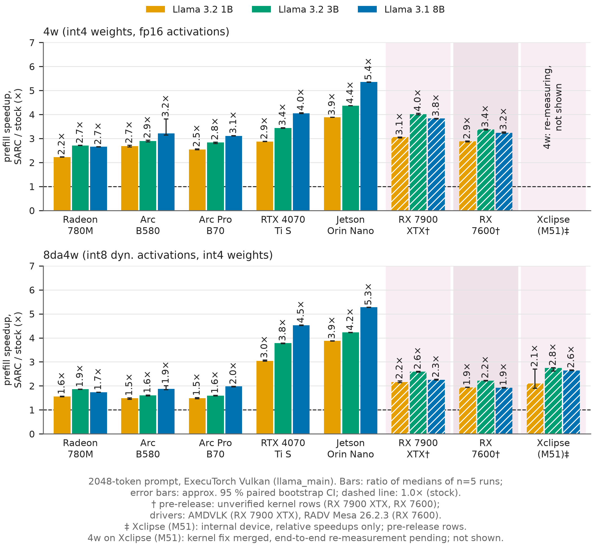
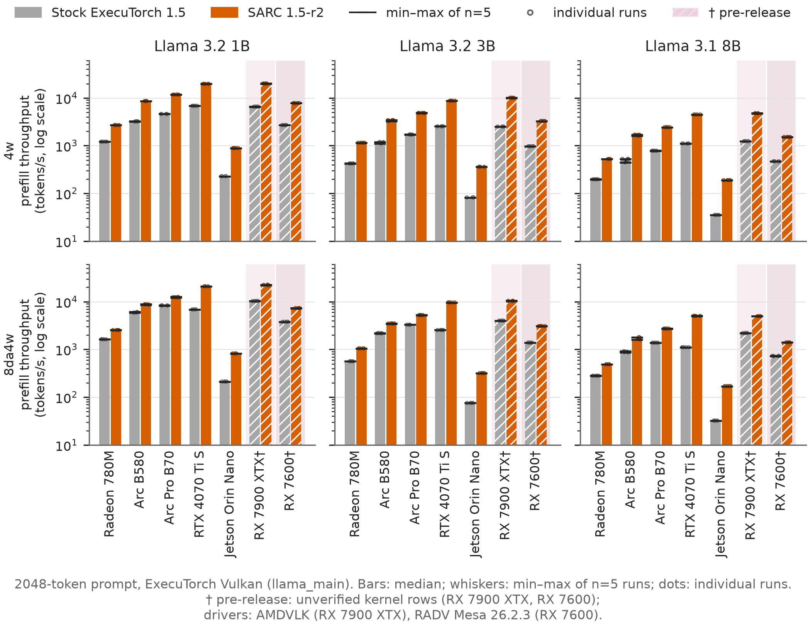
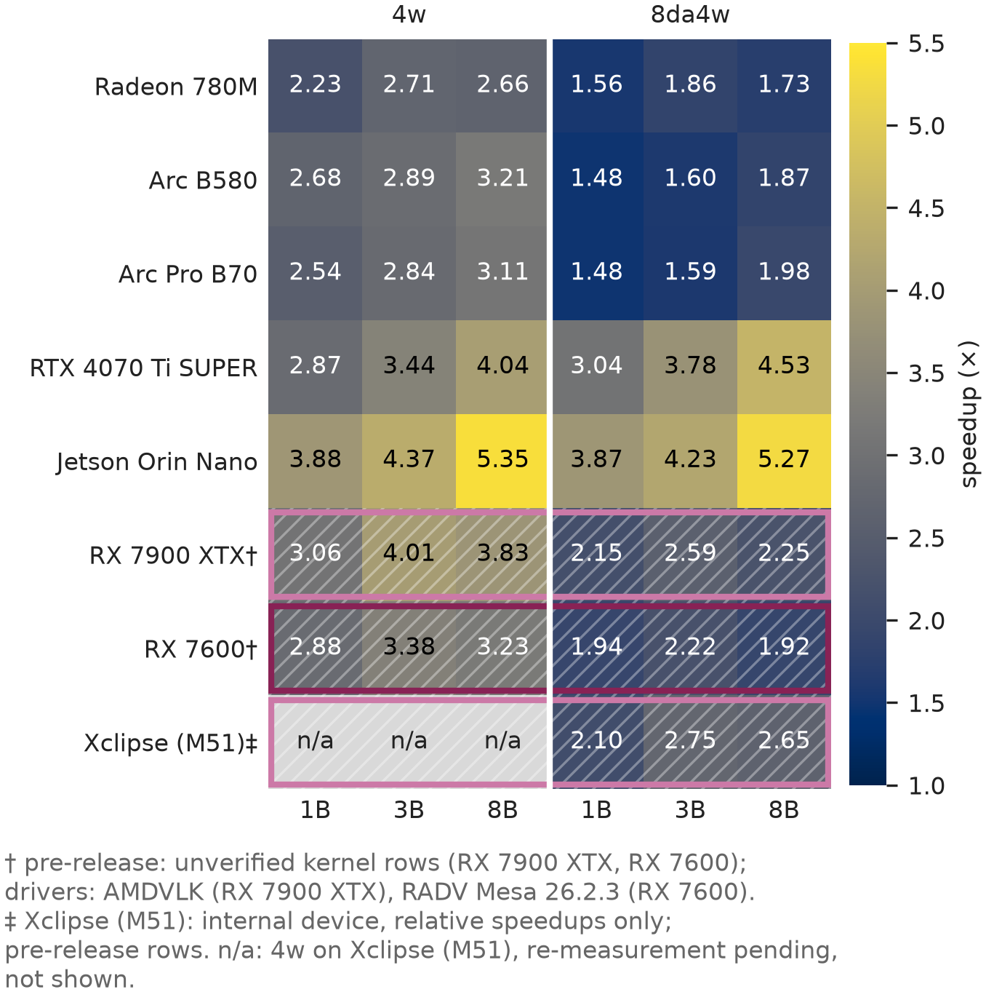

# SARC 1.5-r2 vs stock ExecuTorch 1.5: end-to-end LLM prefill on five GPUs

Campaign `e2e-1.5-2026-09-28`, measured 2026-09-28 02:03–03:51 UTC. An independent audit pass reviewed the
report before publication, and its findings are applied here.

## Summary

SARC's cooperative-matrix (WMMA) kernels, as shipped in `sarc/1.5-r2`, speed up end-to-end 2048-token prefill
over unmodified ExecuTorch release 1.5:
- 1.48–5.35× in all 30 configurations (5 GPUs × 3 Llama models × 2 quantization schemes);
- geometric mean **3.17× for 4w**, **2.39× for 8da4w** and **2.75× overall**;
- largest on Jetson Orin Nano (3.87–5.35×) and RTX 4070 Ti SUPER (2.87–4.53×);
- smallest for 8da4w on the 780M and the two Arc GPUs (1.48–1.98×).

**Correctness.** On a 1972-token real-text prompt, SARC and stock gave the same next token in 27 of 30
configurations. The 3 differences are all at one position in Llama 3.1 8B 8da4w, where stock 1.5 itself returns
a different token depending on the GPU (see Correctness).

**Dispatch (ETDump).** In the SARC build, every prefill GEMM linear ran a SARC coopmat kernel. None did in the
stock build.

*Figures 1–3 include the RX 7900 XTX as a sixth, hatched GPU (†, pre-release: unverified rows, different model export, AMDVLK). The "all 5 GPUs" aggregates exclude it.*

*Figure 1. Prefill speedup of SARC 1.5-r2 over stock ExecuTorch 1.5: the ratio of the medians of n = 5 runs
each. Error bars: approximate 95 % paired bootstrap CI. Dashed line: parity with stock.*

| Geomean speedup | 4w | 8da4w | both |
|---|---|---|---|
| Radeon 780M | 2.52× | 1.71× | 2.08× |
| Arc B580 | 2.92× | 1.64× | 2.19× |
| Arc Pro B70 | 2.82× | 1.67× | 2.17× |
| RTX 4070 Ti SUPER | 3.42× | 3.73× | 3.57× |
| Jetson Orin Nano | 4.49× | 4.42× | 4.46× |
| **all 5 GPUs** | **3.17×** | **2.39×** | **2.75×** |

A sixth GPU, the **Radeon RX 7900 XTX**, was measured by its own agent with the same protocol. It reaches 2.79× over stock (real text; 3.00–3.79× for 4w, 2.09–2.53× for 8da4w). It is reported separately because its SARC rows are still pre-release and its model files are a different export (see "Contributed GPU").

## Results

**Reading the tables**
- Each cell gives prefill tokens/s over the whole 2048-token prompt, as the median of 5 runs, stock → SARC. The
  value is `llama_main`'s PyTorchObserver `prefill_token_per_sec`.
- Below that is the speedup (ratio of the medians) with an approximate 95 % paired bootstrap CI in brackets.
- Full per-cell statistics are in [tables.md](results/tables.md) and [cells.csv](results/cells.csv): the CI of each median,
  min/max, spread, the unpaired CI, and the median of per-repeat ratios.
- Every individual run is in [runs_all.csv](results/runs_all.csv).

**4w** (4-bit group-quantized weights, fp16 activations)

| GPU | Llama 3.2 1B | Llama 3.2 3B | Llama 3.1 8B |
|---|---|---|---|
| Radeon 780M | 1,212 → 2,698 **2.23×** [2.22, 2.23] | 425 → 1,151 **2.71×** [2.70, 2.71] | 198 → 526 **2.66×** [2.65, 2.66] |
| Arc B580 | 3,205 → 8,605 **2.68×** [2.64, 2.71] | 1,183 → 3,419 **2.89×** [2.86, 2.93] | 528 → 1,694 **3.21×** [3.14, 3.81] |
| Arc Pro B70 | 4,613 → 11,703 **2.54×** [2.53, 2.57] | 1,715 → 4,865 **2.84×** [2.79, 2.85] | 784 → 2,438 **3.11×** [3.10, 3.12] |
| RTX 4070 Ti SUPER | 6,850 → 19,692 **2.87×** [2.87, 2.88] | 2,544 → 8,752 **3.44×** [3.42, 3.45] | 1,111 → 4,491 **4.04×** [4.04, 4.07] |
| Jetson Orin Nano | 229 → 891 **3.88×** [3.88, 3.88] | 83 → 360 **4.37×** [4.36, 4.37] | 35 → 190 **5.35×** [5.35, 5.35] |

**8da4w** (8-bit dynamic per-token activations, 4-bit weights)

| GPU | Llama 3.2 1B | Llama 3.2 3B | Llama 3.1 8B |
|---|---|---|---|
| Radeon 780M | 1,636 → 2,544 **1.56×** [1.55, 1.57] | 565 → 1,051 **1.86×** [1.85, 1.87] | 282 → 489 **1.73×** [1.73, 1.74] |
| Arc B580 | 5,936 → 8,790 **1.48×** [1.44, 1.50] | 2,190 → 3,507 **1.60×** [1.58, 1.61] | 896 → 1,680 **1.87×** [1.84, 2.01] |
| Arc Pro B70 | 8,359 → 12,412 **1.48×** [1.47, 1.51] | 3,293 → 5,251 **1.59×** [1.58, 1.60] | 1,386 → 2,738 **1.98×** [1.96, 1.98] |
| RTX 4070 Ti SUPER | 6,872 → 20,898 **3.04×** [3.03, 3.07] | 2,554 → 9,660 **3.78×** [3.76, 3.78] | 1,111 → 5,032 **4.53×** [4.51, 4.53] |
| Jetson Orin Nano | 213 → 823 **3.87×** [3.87, 3.87] | 76 → 320 **4.23×** [4.22, 4.23] | 32 → 170 **5.27×** [5.27, 5.27] |

*Figure 2. Absolute prefill throughput (tokens/s, log scale). Bars: median of n = 5 runs; whiskers: min–max;
dots: individual runs. For 41 of the 60 bars the min–max spread is below 1 %, so the markers hide the whiskers.
The visible spread is on the Arc B580 (see Limitations).*

*Figure 3. Speedup per GPU and configuration (ratio of medians).*

**Observations** (read directly from the data)
- **8da4w gains less than 4w on the 780M, B580 and B70.**
  - Stock 1.5's 8da4w path on these GPUs is already much faster than its 4w path. For example, B580 1B stock
    runs 5,936 tok/s with 8da4w and 3,205 with 4w.
  - The two SARC schemes then reach similar absolute throughput (B580 1B: 8,790 vs 8,605).
  - On the 4070 Ti and Orin, stock 8da4w is about as fast as stock 4w, and the SARC 8da4w speedup is as large as
    the 4w one or larger.
- **After tuning, the faster scheme depends on the GPU**, in absolute tok/s:

  | SARC tok/s, 4w / 8da4w | 1B | 3B | 8B |
  |---|---|---|---|
  | Radeon 780M | **2,698** / 2,544 | **1,151** / 1,051 | **526** / 489 |
  | Jetson Orin Nano | **891** / 823 | **360** / 320 | **190** / 170 |
  | Arc B580 | 8,605 / **8,790** | 3,419 / **3,507** | **1,694** / 1,680 |
  | Arc Pro B70 | 11,703 / **12,412** | 4,865 / **5,251** | 2,438 / **2,738** |
  | RTX 4070 Ti SUPER | 19,692 / **20,898** | 8,752 / **9,660** | 4,491 / **5,032** |

  - The two schemes differ by at most 12.5 %.
  - **Radeon 780M, 4w faster (measured cause).** The 780M's int8 matrix peak (14.4 TOP/s, `matrix_int8`,
    780M standard-v2 roofline campaign) is no higher than its fp16×fp16→fp32 peak (14.8 TFLOP/s,
    `matrix_fp16_fp32`, the accumulator the 4w kernel uses). 8da4w's advantage is int8 matrix throughput, so on
    RDNA3 it gains nothing and only adds the activation-quantization pass and the scale epilogue.
  - **Jetson Orin, 4w faster (not a hardware limit).** On the Orin, int8 has 2× the fp16 peak (19.5 vs 9.7).
    - Its 8da4w row uses the zpgtr kernel ported from the 4070 Ti.
    - Jetson-study counters (`igpu-roofline/docs/JETSON-WMMA-LESSONS.md`) show that kernel family at about 21 %
      Tensor Active, against 55 % for the 4w kernel. Staging and unpacking limit it, not the tensor cores.
    - An Orin-specific 8da4w kernel is the clearest open target.
    - These counters come from the Jetson study, not this campaign.
  - **B70 and 4070 Ti, 8da4w faster by 6–12 %. B580, within ±3 %:** a tie within the B580's noise.
- **The speedup grows with model size on four of the five GPUs.**
  - On the 780M, 8B is slightly below 3B in both schemes (4w 2.66× vs 2.71×, 8da4w 1.73× vs 1.86×).
  - The contributed RX 7900 XTX, also RDNA3 and also running SARC attention, shows the same pattern (4w 4.01× at 3B vs
    3.83× at 8B). Both GPUs speed attention up more than their GEMMs, and attention's share of time falls at 8B.
  - On the B580, the 8B cells are the noisiest in the campaign, so the size of the 8B step there is uncertain.
- **The 780M numbers include attention.** It is the only GPU with a verified SARC SDPA (attention) row, so its
  speedup includes the coopmat QKᵀ/AV kernels and the truncated softmax. On the other four GPUs, attention runs
  the stock 1.5 kernels in both builds.

**Hypotheses** (not tested in this campaign)
- The gain may be larger where stock 1.5 leaves more matrix hardware idle.
- The gain may grow with model size because linears take a larger share of prefill in bigger models.

ETDump was used here only to identify kernels, not to time them; per-kernel time shares would test both
hypotheses.

## Contributed GPU: Radeon RX 7900 XTX (pre-release, measured by the 7900 XTX agent)

The same protocol was run on a Radeon RX 7900 XTX (RDNA3, gfx1100) and merged from
`openspec/changes/sarc-1.5-e2e-benchmark/contrib/7900xtx/`. Measurement setup:
- host `host-7900xtx`, driver AMDVLK 2025.Q2.1;
- builds: stock `release/1.5` (plus the same include backport) vs SARC at `topic/7900xtx-4w-coopmat` @ `8b00c92f1`;
- 5 interleaved repeats, both prompts.

**It is kept separate from the five-GPU results above**:
- **Pre-release rows.** The 7900 XTX rows are still `kUnverified`, so the SARC arm ran with
  `ET_VK_SARC_UNVERIFIED=1`. The shipped release `sarc/1.5-r2` does not yet contain them.
- **Different models.** The model files are a different export (`*_embq_ctx3072.pte`): all 6 SHA-256 hashes
  differ from the five-GPU campaign. Speedups compare stock and SARC on the same file and are valid. Absolute
  tok/s are not directly comparable with the tables above.
- **Different toolchain.** The build was native, with its own glslc, not the pinned container.
- **Co-tenant not stopped.** An idle `ollama` service was running on the GPU host (0 % busy; no sudo there).

| prompt | 4w: 1B / 3B / 8B | 8da4w: 1B / 3B / 8B | geomean |
|---|---|---|---|
| real text 2048 | 6,502 → 19,505 **3.00×** · 2,513 → 9,526 **3.79×** · 1,239 → 4,501 **3.63×** | 10,089 → 21,113 **2.09×** · 3,835 → 9,706 **2.53×** · 2,140 → 4,582 **2.14×** | **2.79×** |
| "the" × 2048 | 3.06× · 4.01× · 3.83× | 2.15× · 2.59× · 2.25× | 2.90× |

- Every cell has n = 5, a paired CI within ±0.08×, no crashes and no rejected runs.
- **Correctness:** on 2048-token aligned real text, the top-1 token matches in 6/6 configurations (max logit
  difference 1.16). On the unaligned 1972-token check prompt, 8B 8da4w shows the same "otherwise"/"bullying"
  near-tie flip as the other GPUs.
- **Kernels:** the ETDump traces show SARC coopmat linears plus the 780M's SARC attention kernels; stock shows no
  SARC kernel.
- The independent re-analysis of the contributed CSVs with `kit/analysis/analyze.py` reproduces every number.

## Contributed GPU: Adreno 840 (Galaxy S26), no releasable speedup yet

The S26 agent ran the same protocol over adb on a Galaxy S26 Ultra (Adreno 840, Android 16, no root). The
data is in `contrib/s26/`, and an independent re-analysis reproduces every cell. **The result is negative:
Adreno has no releasable SARC speedup yet.** It is therefore not shown in the figures.

Real-text prompt, median of 5 runs, stock → SARC:

| | Llama 3.2 1B | Llama 3.2 3B |
|---|---|---|
| 4w | 647 → 633 tok/s, 0.98× [0.88, 1.12] | 197 → 296 tok/s, 1.50× [1.36, 1.67] ‡ |
| 8da4w | 869 → 902 tok/s, 1.04× [0.99, 1.05] | 355 → 343 tok/s, 0.97× [0.94, 1.00] |

‡ The 3B 4w speedup comes from a kernel that is **not correct**. The Adreno 4w SARC kernel (fp16 MMA 64×32×16,
fp16 accumulation) fails the sampled production-diff at K ≥ 3072: 3–9 of 16384 elements are out of tolerance. It
must not be promoted in its current form.

- **8da4w:** there is no Adreno 8-bit SARC row (the 1.4 int8 kernel was wrong), so both arms run the same stock
  kernel. A result of ≈ 1.00× is expected.
- **8B not measured:** Llama 3.1 8B aborts with `VK_ERROR_DEVICE_LOST` in both builds, even after a reboot.
- **Noise:** the phone is noisy. The stock 4w arm has a 17–30 % repeat spread, although the device was cooled
  to SKIN < 38.5 °C and GPU ≤ 45 °C before every run.
- **Other conditions:**
  - clocks could not be read (no root);
  - the model files are the same export as the 7900 XTX's, not the five-GPU campaign's;
  - the build was native (NDK r29), not the pinned container.

## What was compared

**Stock (baseline)**
- Source: upstream ExecuTorch `release/1.5` @ `985c1ceccc`, unmodified except for one compile-only patch.
- The patch adds `#include <algorithm>` in `SharedObject.cpp` and `Squeeze.cpp`. It is upstream commit
  03f41d2031, which is not in release 1.5.
- Without it, GCC 14.3.1 stops with "no matching function for call to `find`" in `SharedObject.cpp`. The failed
  build log is kept at `superseded/build-failed/`.
- The patch adds a header include and no code, so it does not change behaviour.
- The SARC tree carries the same backport, verified in both files.

**SARC**
- Source: tag `sarc/1.5-r2` @ `fd9250c60`, which is release 1.5 plus the SARC release zone.
- The release zone holds the kernel-selection tables, the coopmat shaders and a few hook lines: 38 files differ
  from `985c1ceccc`.
- Kernel choice is by device name, from verified rows only.
- The only environment variable set in either arm is `ETVK_DEVICE_INDEX=0`.

**Builds**

Both builds were made fresh for this campaign from the exact commits. Hashes of every binary are in
[MANIFEST.json](results/MANIFEST.json).
- **x86 hosts**
  - Built in the `et-vk-build:rocky10` container with GCC 14.3.1 and glslc from shaderc v2023.8.
  - The SARC build's shipped SPIR-V matches the repository's golden hashes for all 48 variants.
- **Jetson**
  - Cross-built in the `et-jetson-cross:jp7.2.1` container with GCC 13.3 and shaderc v2026.1. The event tracer
    is compiled into both arms.
  - With that glslc, 11 of the 48 SARC variants compile to different bytes.
  - None of those 11 is dispatched on the Orin. Every variant the Orin does dispatch is byte-identical to the
    golden.

**Models**
- Llama 3.2 1B, Llama 3.2 3B and Llama 3.1 8B, exported for the Vulkan delegate.
- The same `.pte` files (SHA-256 identical) were used on all five hosts.

| GPU | Host | Driver | OS kernel | Idle °C | Notes |
|---|---|---|---|---|---|
| Radeon 780M (iGPU, RDNA3) | rocky-ryzen | RADV, Mesa 25.2.7 | 6.12 (EL10) | 35 | shares DDR5 with the CPU; host idle; no services stopped |
| Arc B580 (Xe2) | fedora | Mesa 26.2.3 (ANV) | 7.2.7 | 36 | also drives this desktop's display; no services stopped |
| Arc Pro B70 (Xe2) | fedora-gpu-eval | Mesa 26.2.3 (ANV) | 7.2.7 | 59 | 8 `llm-api-*` units stopped, then restored; see the co-resident process note |
| RTX 4070 Ti SUPER (Ada) | gpu-dev-4004 | NVIDIA 615.71.09 | 7.0 | 43 | `zun-flux-pipeline.service` (ComfyUI) stopped, then restored |
| Jetson Orin Nano 8 GB (Ampere) | duck-naughty | NVIDIA 595.78, L4T R39.2.1 | 6.8 tegra | 52 | power mode 15 W (not changed); no services stopped |

## Method

**Workload**
- Command: `llama_main --prompt_file prompt_2048.txt --max_new_tokens 1 --temperature 0 --warmup`.
- Every run processed exactly 2048 prompt tokens; this was verified in all 300 logs.
- `--warmup` runs one untimed inference inside the process first.
- Each run is a fresh process, so model load is never timed.
- Decode is excluded by design.

**Design**
- Per GPU: 3 models × 2 schemes × 2 builds × 5 repeats = 60 timed runs, 300 in total.
- Cells run in a fixed order: 1B → 3B → 8B, with 4w before 8da4w.
- Within a cell, the two builds run back to back: stock→SARC on odd repeats, SARC→stock on even ones. With 5
  repeats, stock goes first 3 times and SARC 2 times, so the order balance is approximate.
- GPUs on different hosts ran concurrently, each under its own gpu-lab lock.

**Hygiene**
- One measuring process per GPU, under the gpu-lab lock.
- The known co-tenant GPU services on the 4070 Ti and B70 hosts were stopped for that GPU's whole campaign and
  restored afterwards (units in the table above).
- Clocks were left as found; nothing was pinned.
- Before every run the script waited until the GPU temperature was within 5 °C of the idle baseline. It checked
  every 5 s and gave up after 120 s, so some waits took 121–124 s.
- The B70 host has two B70 cards. The temperature probe takes the maximum over both cards' sensors, and the clock
  snapshot lists both.

**Rejection rule (as implemented)**
- A timed run is rejected if it exits nonzero or reports no throughput. Rejected runs stay in the CSV and are
  retried once.
- No run was rejected: 300/300 accepted.
- Other GPU processes are logged per run but are not used for rejection.

**Correctness check (per cell)**
- Both builds also ran `prompt_check.txt`, a real-text prompt of 1972 tokens, generating 1 token without
  `--warmup`. At 1972 tokens, M is not a multiple of any tile.
- The generated text was compared byte for byte.

**Dispatch evidence**
- One untimed run per cell and build, with an ETDump-enabled binary of the same commit.
- The distinct linear and SDPA kernel names are extracted into [dispatch.md](results/dispatch.md) and
  [dispatch.csv](results/dispatch.csv).

**Statistics**
- Each arm is summarized by its median and its min–max.
- The speedup is the ratio of the medians. Its interval is a percentile bootstrap (20 000 resamples, fixed seed;
  [analyze.py](results/scripts/analyze.py)).
- The bootstrap resamples repeats as pairs, because the design pairs the builds within each repeat. The unpaired
  interval, which is more conservative, is in `cells.csv`.
- With n = 5 these intervals are approximate: their ends lie close to the extreme observations.
- They describe run-to-run noise within one session. They do not cover driver versions, thermal environments or
  other units of the same GPU.

## Dispatched kernels (ETDump)

| GPU | Build | 4w prefill linear | 8da4w prefill linear | SDPA |
|---|---|---|---|---|
| all 5 | stock | `q4gsw_linear_gemm__tin__w_4x8_nc_texture3d` | `linear_dq8ca_q4gsw_tiled_texture3d_texture2d` | stock `sdpa_*_tiled` |
| Radeon 780M | SARC | `sarc_linear_q4gsw_coopmat_t128x128k32g42s32f32c` | `sarc_linear_dq8ca_coopmat_zpg_t128x64k32g42s32` | `sarc_sdpa_{qk,av}_coopmat`, `sarc_sdpa_attn_weights_softmax` |
| Arc B580, Arc Pro B70 | SARC | `sarc_linear_q4gsw_coopmat_t128x128k16g44s16m8fli` | `sarc_linear_dq8ca_coopmat_zpg_t256x64k32g48s16m8` | stock |
| RTX 4070 Ti SUPER | SARC | `..._t256x128k16g42s32ga` (all models); `..._t128x128k16g24s32ga` (1B, some shapes) | `sarc_linear_dq8ca_coopmat_zpgtr_t128x128k64g44s32mk32ra` | stock |
| Jetson Orin Nano | SARC | `..._t256x128k16g22s32` (all models); `..._t128x128k32g42s32f32` (8B, large-K shapes) | `sarc_linear_dq8ca_coopmat_zpgtr_t128x128k64g44s32mk32ra` | stock |

- All prefill linears in these models use texture3d activations.
- The single-token output projection (`q4gsw_linear_gemv_coop` or `linear_dq8ca_q4gsw_coop`, 1 dispatch) and the
  embedding are the same in both builds.
- SARC linear dispatches per prefill: 112 for 1B, 196 for 3B, 224 for 8B.

## Correctness

27 of 30 cells give the same next token with SARC and stock. The three differences are all Llama 3.1 8B 8da4w,
on the 780M, 4070 Ti and Orin. The check prompt ends in a list: "... harassment, abuse, threatening, or ___".

| 8B next token | 4w (fp16 activations) | 8da4w stock 1.5 | 8da4w SARC |
|---|---|---|---|
| Radeon 780M | otherwise | otherwise | bullying |
| Arc B580 | otherwise | bullying | bullying |
| Arc Pro B70 | otherwise | bullying | bullying |
| RTX 4070 Ti SUPER | otherwise | otherwise | bullying |
| Jetson Orin Nano | otherwise | otherwise | bullying |

**What the data show**
- Stock 1.5 itself returns "bullying" on the B580 and B70 and "otherwise" on the other three GPUs. At this
  position the choice depends on accumulation order even within the stock build.
- The two SARC 8da4w kernel families (zpg on AMD and Intel, zpgtr on NVIDIA) give the same token on every GPU.
- Logits measured afterwards (see `TECHNICAL-REPORT.md` §8):
  - In the 8da4w model the two tokens are 0.148 logit apart (stock kernels, Arc B580).
  - The fp32 model ranks "bullying" above "otherwise" by 1.76 logit, but its top choice is "stalking".
  - This is consistent with a near-tie. SARC's own logits are still unmeasured.

**Earlier evidence and its limits**
- During promotion (`openspec/changes/sarc-1.5-8da4w-port`), the same 8da4w kernels passed the sampled
  production-diff check: 1B/3B/8B × buffer/texture3d, with nonzero activation zero points.
- That promotion compared next tokens on 1B only, so this campaign is the first 8B 8da4w next-token comparison.
- A top-2 logit margin at this position would settle the question.

## Consistency with earlier measurements

The porting-time single runs (`openspec/changes/sarc-1.5-*`) agree with these medians within 2 %:
- 780M SARC 4w 1B/3B/8B: 2695/1138/516 then vs 2698/1151/526 now (8B +1.9 %);
- B580 8da4w 1B: 8790 vs 8790;
- 4070 Ti 8da4w 1B: 21113 vs 20898 (−1.0 %);
- Orin 4w 1B: 890 vs 891.

## Limitations and disclosures

**Arc B580 variance**
- The B580 also drives this desktop's display.
- A few runs were sporadically slow in both arms, e.g. 8B 4w stock 445 tok/s against a median of 528.
- Four B580 cells exceed a 3 % repeat spread: 3B 4w, 8B 4w, 1B 8da4w and 8B 8da4w. The worst is 19 %, in 8B 4w
  stock.
- Medians are robust to these outliers, but these intervals are wider.
- The B580's thermal state also changed during the run:
  - its idle baseline (36 °C) was measured with the desktop quiet;
  - from timed run 22 of 60 (3B 4w, repeat 2) on, the sensor read exactly 50 °C before every run, 38 of 60
    timed runs;
  - the cool-down target of 41 °C was therefore never met, and 46 of all 72 B580 runs waited the full 120 s. The
    wait was the same for both arms.
- All other GPUs have a repeat spread of at most 2.5 % in every cell.

**Arc Pro B70 cool-down**
- Idle was 59 °C, so the target was 64 °C.
- 14 of 60 timed runs (15 of 72 overall) reached the 120 s limit.
- The probe covers both B70 cards on that host (see Method).

**Co-resident process on the B70 host**
- A ComfyUI test instance (`comfyui-h3-test`, port 8189) was running under the host's `gpu-lease` on both B70s.
  All 60 B70 timed runs log it as another GPU process.
- It was not stopped because it is not one of the host's known services.
- Its own history shows its last job finished at 23:45 UTC on 2026-09-27, and its queue was empty. The B70 runs
  took place from 02:07 to 02:43 UTC, so it did no GPU work during them and only held memory.
- The B70 spreads are at most 2.5 % in every cell, and its 1B 8da4w SARC median (12,412) equals the porting-time
  run.

**Clocks**
- Clocks were not pinned.
- The per-run `clocks` field in `runs.csv` is a snapshot taken right after `llama_main` exits, and it is not
  comparable across GPUs:
  - Orin: `devfreq=306 MHz`, already idle;
  - 780M: `sclk=2800 MHz`, still at its maximum;
  - 4070 Ti: P0 at 2595–2790 MHz;
  - B580 rows: the `sclk=600Mhz` field belongs to the host's Ryzen 9600X iGPU. The B580's value is `xe_act`.
- These snapshots document the state between runs, not the clock under load.

**Prompt content**
- `prompt_2048.txt` is the word "the" repeated 2048 times.
- Prefill arithmetic does not depend on token values, but power draw can. On a power-limited GPU (4070 Ti), a
  low-toggle input may run at higher clocks than real text.
- Both builds used the same prompt, so speedups are less exposed than absolute tok/s.
- A real-text timing check is a pending follow-up.

**Timer resolution**
- The runner times prefill in whole milliseconds.
- On the shortest runs this matters: 4070 Ti 1B prefill takes about 100 ms, so one 1 ms step is about 1 %. All 5
  SARC runs of 4070 Ti 1B 4w report exactly 19,692.3.
- It does not matter on the Orin (2.3–63 s per run), so its narrow intervals reflect genuine stability.

**Check runs**
- The `prompt_check.txt` runs (`log` = `logs/check-*` in `runs_all.csv`) have no `--warmup`, so their tok/s
  includes first-inference pipeline creation.
- They are used only for the next-token comparison.

**Scope of SARC in this release**
- Attention is tuned only on the 780M.
- The other shipped rows (Xclipse, Adreno) are unverified and inert, and were not tested here.

**Not measured:** decode throughput.

## Reproduce

Everything is in `sarc-acl/.artifacts/e2e-1.5-2026-09-28/`:
- `tools/`: the build, stage, wrap, e2e and trace scripts, the prompts, and a copy of the Jetson cross recipe;
- `src/`: both source trees and the backport patch;
- `build/`: the builds and `MANIFEST.json`;
- `raw/<gpu>/`: the CSVs, logs, ETDumps, and environment and service records;
- `report/`: `analyze.py`, `dispatch.py`, and the figures (`figures/make_all.sh`);
- `superseded/`: the failed build log, and the aborted first Orin start (temperature-probe bug).
